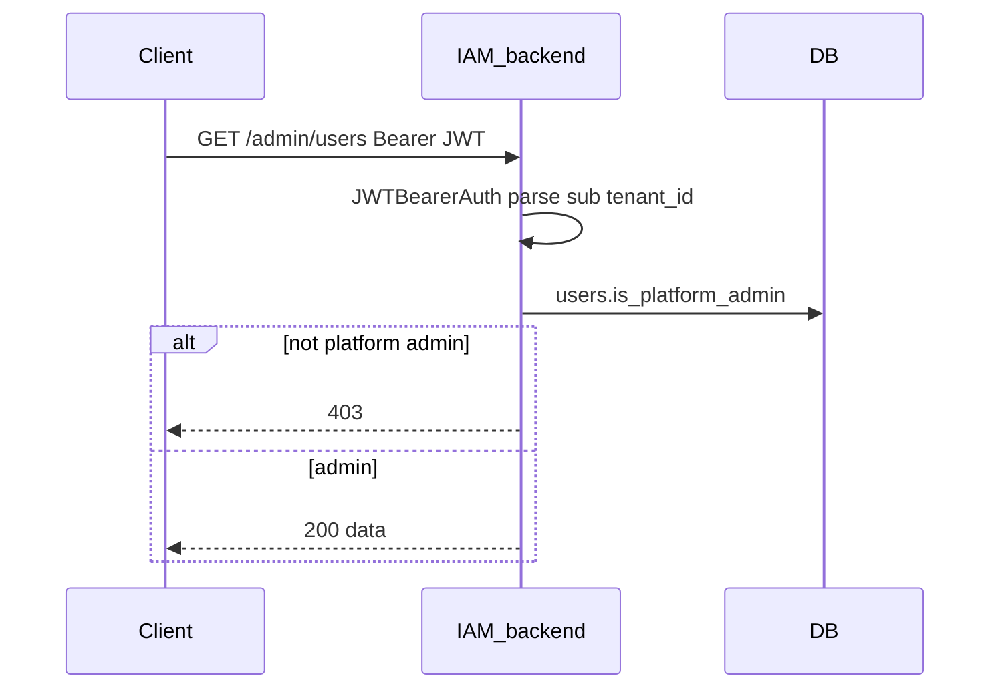

# Authorization

## Summary

GateForge IAM is a **native IdP**. Authorization uses two layers: **platform admin** (`users.is_platform_admin`) for the operator console and **`tenant_memberships.role`** for per-tenant access. Dashboard JWTs carry `user_id` (`sub`) and active `tenant_id`; platform admin status is loaded from the database on `/me` and admin routes, not embedded in the JWT.

## Platform admin

| Mechanism | Detail |
|-----------|--------|
| Flag | `users.is_platform_admin` (boolean) |
| Bootstrap | First startup: `BOOTSTRAP_ADMIN_EMAIL` + `BOOTSTRAP_ADMIN_PASSWORD` if no admins exist |
| Middleware | `PlatformAdminAuth` after `JWTBearerAuth` |
| Routes | `/api/v1/admin/*` |

### Admin API routes

| Method | Path |
|--------|------|
| GET | `/api/v1/admin/stats` |
| GET | `/api/v1/admin/users` |
| GET | `/api/v1/admin/tenants` |
| GET | `/api/v1/admin/clients` |
| GET | `/api/v1/admin/tenants/:tenantId/identity-providers` |
| PATCH | `/api/v1/admin/tenants/:tenantId/identity-providers/google` |
| POST | `/api/v1/admin/tenants/:tenantId/members` |
| DELETE | `/api/v1/admin/tenants/:tenantId/members/:userId` |

### Internal operator route (API key)

| Method | Path | Auth |
|--------|------|------|
| PATCH | `/api/v1/internal/tenants/:tenantId/identity-providers/google` | `X-Admin-API-Key` |

Returns 404 if `ADMIN_API_KEY` is unset on the server.

## Tenant roles

Stored on `tenant_memberships`:

| Role | Typical use |
|------|-------------|
| `member` | Default on register |
| `admin` | Tenant-scoped admin (membership); bootstrap admin gets this on default tenant |

| Status | Meaning |
|--------|---------|
| `active` | Can authenticate for tenant |
| `invited` | Pending |
| `suspended` | Blocked |

Tenant roles are **not** JWT realm/client roles — they are resolved from Postgres when needed.

## JWT (dashboard API)

From `internal/auth/jwt.go`:

```json
{
  "sub": "<user_id>",
  "tenant_id": "<active_tenant_id>",
  "iss": "<app_name>",
  "exp": "...",
  "iat": "..."
}
```

`GET /api/v1/me` returns user profile including `is_platform_admin`.

## Request flow (admin route)



## Persistence

### PostgreSQL

| Table / column | Purpose |
|----------------|---------|
| `users.is_platform_admin` | Platform operator flag |
| `tenant_memberships.role` | Tenant-scoped role |
| `tenant_memberships.status` | Membership state |

### Redis

None.

## Code map

| Layer | File |
|-------|------|
| Admin middleware | `internal/middlewares/admin_auth.go` |
| JWT middleware | `internal/middlewares/auth.go` |
| Admin handler | `internal/handlers/admin.go` |
| Admin service | `internal/services/admin.go` |
| Platform bootstrap | `internal/services/platform_admin_bootstrap.go` |
| User repo | `internal/repositories/user.go` (`SetPlatformAdmin`, `CountPlatformAdmins`) |
| Constants | `internal/constants/tenant_membership.go` |

## Configuration

| Variable | Purpose |
|----------|---------|
| `BOOTSTRAP_ADMIN_EMAIL` | First-run platform admin email |
| `BOOTSTRAP_ADMIN_PASSWORD` | First-run platform admin password |
| `ADMIN_API_KEY` | Internal IdP toggle (`/internal/...`) |

## Frontend touchpoints

- `AdminRoute` in `frontend/src/routes/guards.tsx` checks `user.is_platform_admin`
- Console routes under `/console/*` require admin
- Guest redirect: admins → `/console`, others → `/settings/profile`

## Testing

- Bootstrap admin via env on fresh DB
- Admin APIs: Bearer token from platform admin login
- Internal Google toggle: [testing/FEDERATION_CURL.md](../testing/FEDERATION_CURL.md)

## Related features

- [MULTI_TENANT.md](MULTI_TENANT.md) — membership roles
- [FEDERATION.md](FEDERATION.md) — admin IdP configuration
