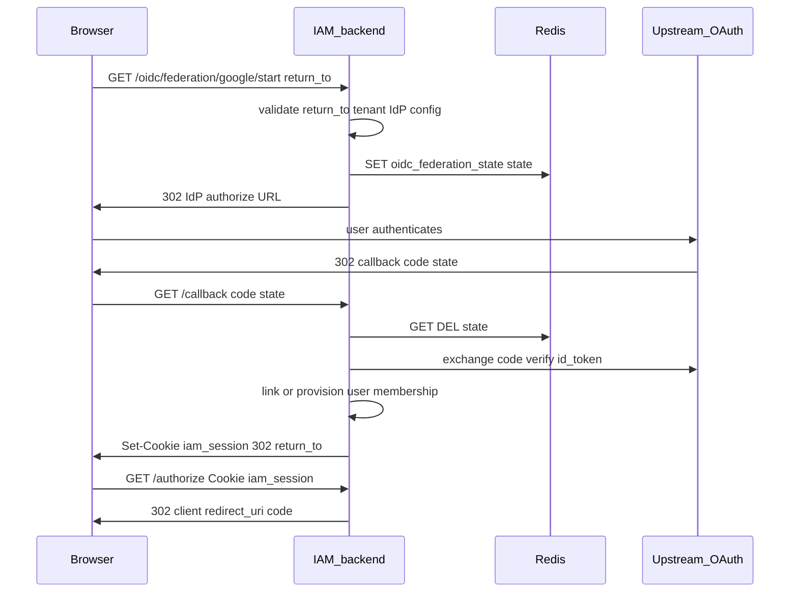

# Federation (upstream OAuth/OIDC)

## Summary

GateForge IAM acts as an **OAuth/OIDC client** to upstream identity providers. The browser starts at `/oidc/federation/:provider/start`, authenticates at the upstream IdP, returns to `/callback`, and the server links or provisions a user, sets `iam_session`, and redirects to `return_to` (typically a full `/authorize` URL). OIDC token issuance then continues as in [OIDC.md](OIDC.md).

Supported providers are defined in the **provider catalog** (`internal/constants/identity_provider.go`). Google is the first entry; adding another standard OIDC IdP is a catalog entry plus a frontend icon.

## Endpoints

| Method | Path | Auth |
|--------|------|------|
| GET | `/oidc/federation/:provider/start` | Public |
| GET | `/oidc/federation/:provider/callback` | Public |
| GET | `/api/v1/federation/providers?tenant_id=` | Public |
| PATCH | `/api/v1/internal/tenants/:tenantId/identity-providers/:provider` | `X-Admin-API-Key` |
| PATCH | `/api/v1/admin/tenants/:tenantId/identity-providers/:provider` | JWT + platform admin |
| GET | `/api/v1/admin/tenants/:tenantId/identity-providers` | JWT + platform admin |

Use `provider=google` for Google.

## Request flow

## Persistence

### PostgreSQL

| Table | Operations |
|-------|------------|
| `tenant_identity_providers` | Read: `enabled` + OAuth credentials for tenant + provider; admin PATCH configures |
| `federated_identities` | Read/link by `(provider, subject)`; write on first link |
| `users` | Create on JIT provision; read on return visit |
| `tenant_memberships` | Create or ensure active membership for tenant in OAuth state |
| `sessions` | Insert on successful callback |

**Schema note:** `federated_identities` is **global** — unique on `(provider, subject)` without `tenant_id`. Tenant context comes from the OAuth **state** payload stored in Redis at start.

### Redis

| Key | TTL | Payload |
|-----|-----|---------|
| `oidc_federation_state:{state}` | 10m | `return_to`, `tenant_id`, `nonce`, `provider` |

Single-use: loaded and deleted on callback.

## Code map

| Layer | File |
|-------|------|
| Provider catalog | `internal/constants/identity_provider.go` |
| Handler | `internal/handlers/oidc.go` (federation routes) |
| Service | `internal/services/federation.go` |
| OIDC provider impl | `internal/services/federation_oidc.go` |
| Federation helpers | `internal/services/federation_config.go` |
| Admin | `internal/handlers/admin.go`, `internal/handlers/tenant_identity_provider_admin.go` |
| Repos | `federated_identities`, `tenant_identity_providers`, `users`, `tenant_memberships` |

## Configuration

| Variable | Purpose |
|----------|---------|
| `DEFAULT_TENANT_ID` | Fallback tenant when not in state |
| `ADMIN_API_KEY` | Enables internal IdP admin PATCH |
| `APP_BASE_URL` | `return_to` validation |
| `MFA_ENCRYPTION_KEY` | Encrypts OAuth client secrets at rest |

OAuth client ID and secret are stored **per tenant** in `tenant_identity_providers` (configure via admin console or internal PATCH).

## Adding a provider

1. Add an `IdentityProviderSpec` entry to `SupportedIdentityProviders` in `internal/constants/identity_provider.go` (id, display name, issuer URL, scopes, optional auth URL params and setup console URL).
2. The federation registry picks it up automatically — no new routes or handlers.
3. Add an icon in `frontend/src/features/login/federation-provider-icons.tsx` (`FEDERATION_ICONS` map).

For IdPs that need extra per-tenant config (e.g. Microsoft `tenant_id`), add optional fields to the `config JSONB` column and admin form in a follow-up.

## Frontend touchpoints

- `federationStartUrl(provider, returnTo)` in `frontend/src/api/client.ts`
- Login: `SocialLoginGrid` driven by `GET /api/v1/federation/providers`
- Admin console: `frontend/src/pages/console/identity-providers-page.tsx`

## Testing

- [testing/FEDERATION_CURL.md](../testing/FEDERATION_CURL.md)
- Full browser flow required after upstream redirect (curl can only inspect start redirect)

## Related features

- [OIDC.md](OIDC.md) — after federation sets session
- [SSO_SESSION.md](SSO_SESSION.md) — `iam_session` semantics
- [MULTI_TENANT.md](MULTI_TENANT.md) — tenant in federation state
- [AUTHORIZATION.md](AUTHORIZATION.md) — admin IdP routes
