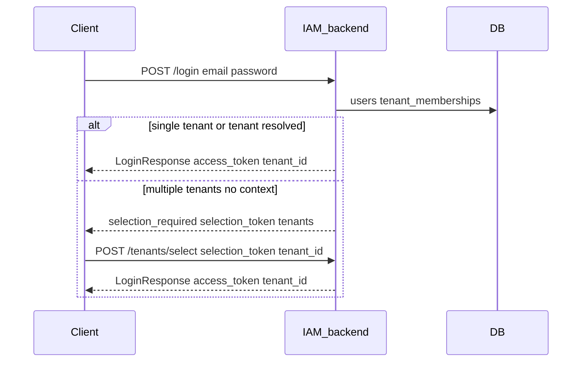
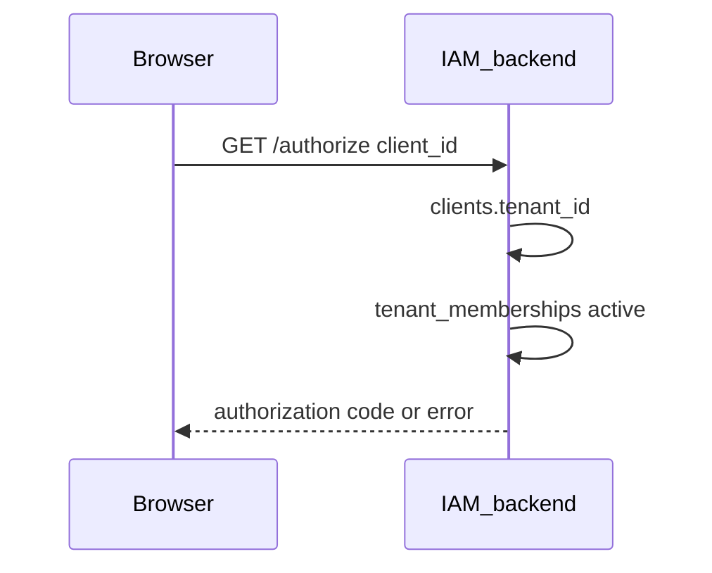

# Multi-tenant memberships

## Summary

Users are **global identities** (unique `email_lower`). Access to an organization is granted via **`tenant_memberships`**. Dashboard JWTs include `tenant_id` as the active tenant. When a user belongs to multiple tenants and no tenant is resolved at login, the API returns **`selection_required`** with a short-lived **`selection_token`**; the client completes login with `POST /api/v1/tenants/select`. Authenticated users switch tenants with `POST /api/v1/tenants/switch`. OIDC `/authorize` resolves tenant from the OAuth **`client_id`** and requires active membership in that tenant.

Adding a person to a tenant emails them. If they already have an account, the membership is active immediately. If they do not, the email links to sign-in and the account is created when they set a password. They still see the organization in the console switcher after they sign in.

## Endpoints

| Method | Path | Auth |
|--------|------|------|
| POST | `/api/v1/register` | Public (creates user + membership) |
| POST | `/api/v1/login` | Public (may return `selection_required`) |
| POST | `/api/v1/tenants/select` | Public (`selection_token`) |
| POST | `/api/v1/tenants/switch` | Bearer JWT |
| GET | `/api/v1/me/tenants` | Bearer JWT |
| GET | `/authorize` | Cookie (tenant from OAuth client) |

## Request flow

### Login with tenant selection

```mermaid
sequenceDiagram
    participant Client
    participant API as IAM_backend
    participant DB

    Client->>API: POST /login email password
    API->>DB: users tenant_memberships
    alt single tenant or tenant resolved
        API-->>Client: LoginResponse access_token tenant_id
    else multiple tenants no context
        API-->>Client: selection_required selection_token tenants
        Client->>API: POST /tenants/select selection_token tenant_id
        API-->>Client: LoginResponse access_token tenant_id
    end
```

### OIDC authorize

```mermaid
sequenceDiagram
    participant Browser
    participant API as IAM_backend

    Browser->>API: GET /authorize client_id
    API->>API: clients.tenant_id
    API->>API: tenant_memberships active
    API-->>Browser: authorization code or error
```

## Membership model

| Column | Values |
|--------|--------|
| `role` | `member`, `admin` |
| `status` | `active`, `invited`, `suspended` |

Constants: `internal/constants/tenant_membership.go`.

Platform-wide admin is separate: `users.is_platform_admin` — see [AUTHORIZATION.md](AUTHORIZATION.md).

## Member notification

`POST /admin/tenants/{tenantId}/members` looks up the email.

- An existing user who is not already a member gets an active membership and the `member_added` email.
- An unknown email gets a pending `tenant_invites` row and the `member_invite` email. The link is `{OIDC_LOGIN_PAGE_URL}?invite=...` (or `{APP_BASE_URL}/login` when the login page URL is unset). `POST /api/v1/invites/accept` creates the user when they do not exist, adds the membership, marks the email verified, and returns a session. An existing account with MFA enabled still gets the membership, then completes MFA before the session is issued.

Delivery uses `EMAIL_PROVIDER` (`ses`, `resend`, or local `mailpit`). A send failure is logged with a masked address and does not remove the membership or invite. The add-member API still returns 204. A user who is already a member is not emailed again.

`GET /admin/invites` lists every pending invite for the Users page, including ones past their expiry (those rows report status `expired`) and the organization name. `GET /admin/tenants/{tenantId}/invites` is the same list for one organization. `POST /admin/tenants/{tenantId}/invites/{inviteId}/resend` rotates the link, extends the expiry, and sends `member_invite` again. The list does not include the invite token.

## JWT claims (dashboard API)

HS256 access token (`internal/auth/jwt.go`):

| Claim | Description |
|-------|-------------|
| `sub` | User ID |
| `tenant_id` | Active tenant for this session |
| `iss`, `exp`, `iat` | Standard registered claims |

**Selection token:** short-lived JWT with `sub` only (no `tenant_id`) for tenant picker.

`is_platform_admin` is **not** in the JWT — returned on `GET /api/v1/me`.

## Persistence

### PostgreSQL

| Table | Operations |
|-------|------------|
| `users` | Global identity; no `tenant_id` column (post multi-tenant migration) |
| `tenant_memberships` | Junction: user ↔ tenant with role/status |
| `tenants` | Organization records |
| `clients` | OAuth client → `tenant_id` for OIDC |

### Redis

None.

## Code map

| Layer | File |
|-------|------|
| User service | `internal/services/user.go` |
| Tenant context | `internal/services/tenant_context.go` |
| Auth handler | `internal/handlers/auth.go` |
| OIDC service | `internal/services/oidc.go` (membership check on authorize) |
| Membership repo | `internal/repositories/tenant_membership.go` |

## Configuration

| Variable | Purpose |
|----------|---------|
| `DEFAULT_TENANT_ID` | Fallback when tenant not specified (register, federation) |

## Frontend touchpoints

- Login/register forms may pass `tenant_id` via env `VITE_DEFAULT_TENANT_ID`
- Admin console tenant/member management: `frontend/src/pages/console/`

## Testing

- Register + login flows in [testing/PASSKEY_MFA_CURL.md](../testing/PASSKEY_MFA_CURL.md)
- OIDC tenant binding in [testing/OIDC_CURL.md](../testing/OIDC_CURL.md)

## Related features

- [OIDC.md](OIDC.md) — tenant from OAuth client
- [AUTHORIZATION.md](AUTHORIZATION.md) — tenant `admin` vs platform admin
- [FEDERATION.md](FEDERATION.md) — membership on federated login
