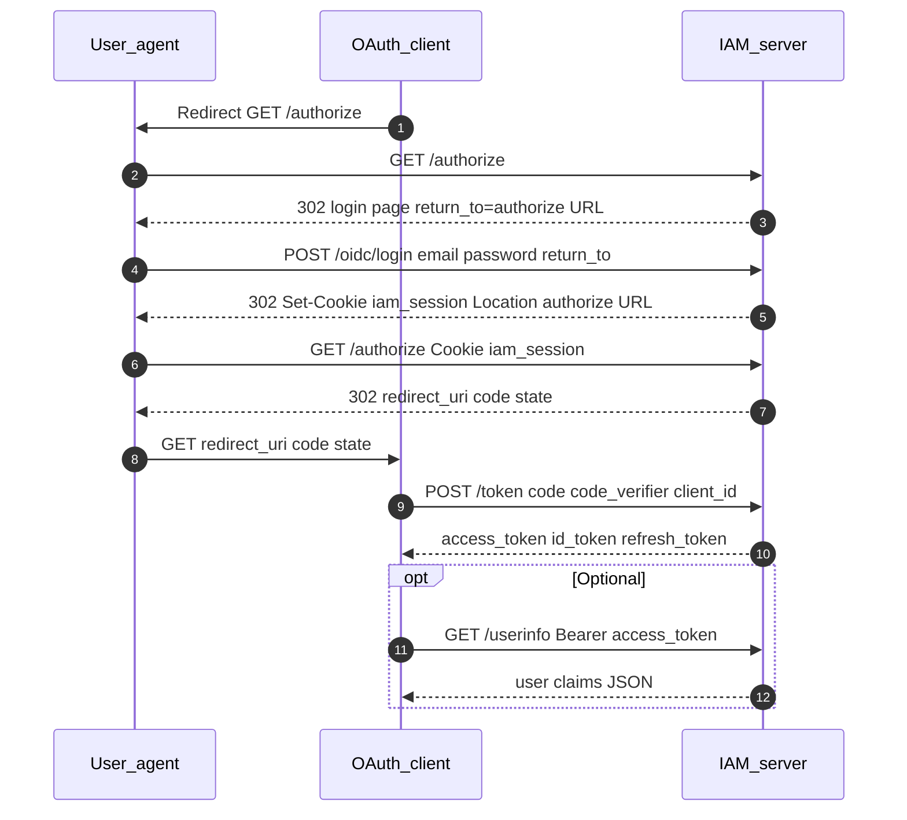

# OIDC (authorization code + PKCE)

## Summary

GateForge IAM acts as an **OpenID Provider (IdP)**. Relying parties use the standard **authorization code flow with PKCE (S256)**. The browser holds an `iam_session` cookie after login; `/authorize` issues an authorization code; the client exchanges it at `/token` for OIDC access token, ID token, and refresh token.

## Endpoints

| Method | Path | Auth |
|--------|------|------|
| GET | `/.well-known/openid-configuration` | Public |
| GET | `/.well-known/jwks.json` | Public |
| GET | `/authorize` | Browser `iam_session` (or redirect to login) |
| POST | `/oidc/login` | Public (CSRF required) |
| POST | `/token` | Public (client auth for confidential clients) |
| GET | `/userinfo` | Bearer (OIDC RS256 access token) |

Dashboard/API login (`POST /api/v1/login`) is an alternate path to obtain `iam_session` before `/authorize` — see [SSO_SESSION.md](SSO_SESSION.md).

## Request flow

### Tenant resolution

- `/authorize` loads the OAuth client by `client_id` → `clients.tenant_id`.
- The authenticated user must have an **active** row in `tenant_memberships` for that tenant.
- See [MULTI_TENANT.md](MULTI_TENANT.md) for membership model.

### PKCE

- `code_challenge` + `code_challenge_method=S256` on `/authorize`.
- Same `code_verifier` sent to `/token`; validated against stored `authorization_codes.code_challenge`.

### Consent

- Stored in `consents` per `(tenant_id, user_id, oauth_client_id)`.
- Scopes recorded on `authorization_codes.scope`.

## Persistence

### PostgreSQL

| Table | Operations |
|-------|------------|
| `clients` | Read: validate `client_id`, redirect URIs, tenant |
| `authorization_codes` | Write on authorize; read + consume on token exchange |
| `access_tokens` | Write opaque token hash on token response |
| `refresh_tokens` | Write on token response |
| `consents` | Read/write scope grants |
| `tenant_memberships` | Read: user must belong to client's tenant |
| `users` | Read: subject for tokens and userinfo |

### Redis

None for core OIDC (session cookie resolves via `sessions` table).

## Code map

| Layer | File |
|-------|------|
| Handler | `internal/handlers/oidc.go` |
| Service | `internal/services/oidc.go` |
| OIDC signing | `internal/auth/oidc_signer.go` |
| Repos | `internal/repositories/` (clients, authorization codes, tokens, consents) |

## Configuration

| Variable | Purpose |
|----------|---------|
| `APP_BASE_URL` | Issuer, discovery URLs, redirect validation |
| `OIDC_LOGIN_PAGE_URL` | Login redirect when no session |
| `OIDC_RSA_PRIVATE_KEY_PEM` / `OIDC_RSA_PRIVATE_KEY_FILE` | RS256 signing for OIDC tokens |
| `OIDC_KEY_ID` | JWKS key id |

## Frontend touchpoints

- Login page posts to `/oidc/login` with CSRF (`prefetchCsrfToken()` in `frontend/src/api/client.ts`).
- Vite dev proxy forwards root OIDC paths to backend.

## Testing

- [testing/OIDC_CURL.md](../testing/OIDC_CURL.md)
- [postman/IAM_OIDC.postman_collection.json](../postman/IAM_OIDC.postman_collection.json)

## Related features

- [SSO_SESSION.md](SSO_SESSION.md) — shared `iam_session` cookie
- [MULTI_TENANT.md](MULTI_TENANT.md) — tenant from OAuth client
- [FEDERATION.md](FEDERATION.md) — upstream login then `/authorize`
