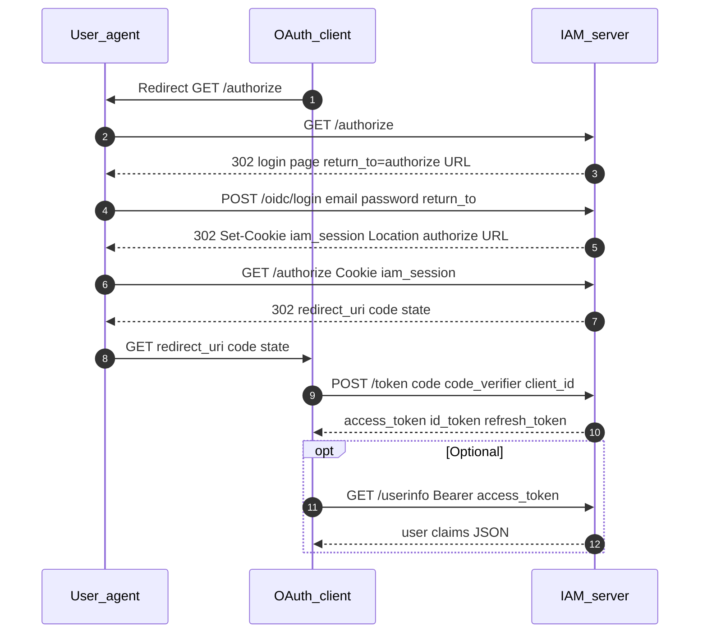

# OIDC (authorization code + PKCE)

## Summary

GateForge IAM acts as an **OpenID Provider (IdP)**. Relying parties use the standard **authorization code flow with PKCE (S256)**. The browser holds an `iam_session` cookie after login; `/authorize` issues an authorization code; the client exchanges it at `/token` for OIDC access token, ID token, and refresh token.

## Endpoints

| Method | Path | Auth |
|--------|------|------|
| GET | `/.well-known/openid-configuration` | Public |
| GET | `/.well-known/jwks.json` | Public |
| GET | `/authorize` | Browser `iam_session` (or redirect to login) |
| POST | `/oidc/login` | Public (CSRF required) |
| POST | `/token` | Public (client auth for confidential clients) |
| POST | `/introspect` | Confidential client (`client_secret_basic` / `client_secret_post`) |
| GET | `/userinfo` | Bearer (OIDC RS256 access token) |

Dashboard/API login (`POST /api/v1/login`) is an alternate path to obtain `iam_session` before `/authorize` — see [SSO_SESSION.md](SSO_SESSION.md).

### Token introspection (RFC 7662)

`POST /introspect` lets a **confidential** OAuth client (typically a resource server) check whether an OIDC access or refresh token is active.

| Token kind | How validated | Active response fields |
|------------|---------------|------------------------|
| Access (RS256 JWT) | Signature + issuer + expiry | `active`, `scope`, `client_id`, `sub`, `exp`, `iat`, `iss`, `aud`, `token_type=access_token` |
| Refresh (opaque) | SHA-256 hash lookup in `refresh_tokens` | `active`, `client_id`, `sub`, `exp`, `token_type=refresh_token` |

- Public clients and bad credentials → `401 invalid_client`.
- Unknown / expired / revoked tokens → `200` with `{ "active": false }` only.
- Access tokens are **not** stored server-side; they remain valid until JWT expiry (no server-side revoke).
- Optional `token_type_hint`: `access_token` or `refresh_token`.

## Request flow

```mermaid
sequenceDiagram
    autonumber
    participant UA as User_agent
    participant RP as OAuth_client
    participant AS as IAM_server

    RP->>UA: Redirect GET /authorize
    UA->>AS: GET /authorize
    AS-->>UA: 302 login page return_to=authorize URL

    UA->>AS: POST /oidc/login email password return_to
    AS-->>UA: 302 Set-Cookie iam_session Location authorize URL

    UA->>AS: GET /authorize Cookie iam_session
    AS-->>UA: 302 redirect_uri code state

    UA->>RP: GET redirect_uri code state
    RP->>AS: POST /token code code_verifier client_id
    AS-->>RP: access_token id_token refresh_token

    opt Optional
        RP->>AS: GET /userinfo Bearer access_token
        AS-->>RP: user claims JSON
    end
```

### Tenant resolution

- `/authorize` loads the OAuth client by `client_id` → `clients.tenant_id`.
- The authenticated user must have an **active** row in `tenant_memberships` for that tenant.
- See [MULTI_TENANT.md](MULTI_TENANT.md) for membership model.

### PKCE

- `code_challenge` + `code_challenge_method=S256` on `/authorize`.
- Same `code_verifier` sent to `/token`; validated against stored `authorization_codes.code_challenge`.

### Consent

Consent screens are **not enforced**. The `consents` table exists, but `/authorize` does not read or write it. Requested scopes are stored on the authorization code and copied onto the refresh token.

### Refresh tokens

`POST /token` accepts `grant_type=refresh_token`. The refresh token is opaque. Rotation happens in one database transaction:

- A live token is revoked and replaced with a new row that keeps the same `family_id`.
- Presenting an already revoked token revokes every row in that family and returns `invalid_grant`.
- An ID token is issued on refresh only when the stored scope includes `openid`.

Authorization codes are consumed with one locked delete. If signing fails after consume, the code stays spent and the client must authorize again.

Client secrets are stored as `hmac-sha256:<hex>` using `CLIENT_SECRET_PEPPER`. A leftover plaintext secret is compared in constant time and upgraded on the next successful `/token` or `/introspect`.

`/.well-known/jwks.json` is precomputed and sent with `Cache-Control: public, max-age=300`. Set `OIDC_RSA_PREVIOUS_PRIVATE_KEY_PEM` and `OIDC_PREVIOUS_KEY_ID` while rotating: both public keys are published, and only the active key signs new tokens. Verification accepts either key. Every replica must load the same PEMs. Drop the previous key only after access tokens signed with it have expired.

## Persistence

### PostgreSQL

| Table | Operations |
|-------|------------|
| `clients` | Read: validate `client_id`, redirect URIs, tenant; confidential auth for `/introspect` |
| `authorization_codes` | Write on authorize; read + consume on token exchange |
| `access_tokens` | Legacy schema (unused — OIDC access tokens are RS256 JWTs) |
| `refresh_tokens` | Write on token response; rotate on `refresh_token` grant; read on `/introspect` |
| `consents` | Schema only. Consent is not enforced |
| `tenant_memberships` | Read: user must belong to client's tenant |
| `users` | Read: subject for tokens and userinfo |

### Redis

None for core OIDC (session cookie resolves via `sessions` table).

## Code map

| Layer | File |
|-------|------|
| Handler | `internal/handlers/oidc.go` |
| Service | `internal/services/oidc.go` |
| OIDC signing | `internal/auth/oidc_signer.go` |
| Repos | `internal/repositories/` (clients, authorization codes, tokens, consents) |

## Configuration

| Variable | Purpose |
|----------|---------|
| `APP_BASE_URL` | Issuer, discovery URLs, redirect validation |
| `OIDC_LOGIN_PAGE_URL` | Login redirect when no session |
| `OIDC_RSA_PRIVATE_KEY_PEM` / `OIDC_RSA_PRIVATE_KEY_FILE` | RS256 signing for OIDC tokens |
| `OIDC_KEY_ID` | JWKS key id |

## Frontend touchpoints

- Login page posts to `/oidc/login` with CSRF (`prefetchCsrfToken()` in `frontend/src/api/client.ts`).
- Vite dev proxy forwards root OIDC paths to backend.

## Testing

- [testing/OIDC_CURL.md](../testing/OIDC_CURL.md)
- [postman/IAM_OIDC.postman_collection.json](../postman/IAM_OIDC.postman_collection.json)

## Related features

- [SSO_SESSION.md](SSO_SESSION.md) — shared `iam_session` cookie
- [MULTI_TENANT.md](MULTI_TENANT.md) — tenant from OAuth client
- [FEDERATION.md](FEDERATION.md) — upstream login then `/authorize`
