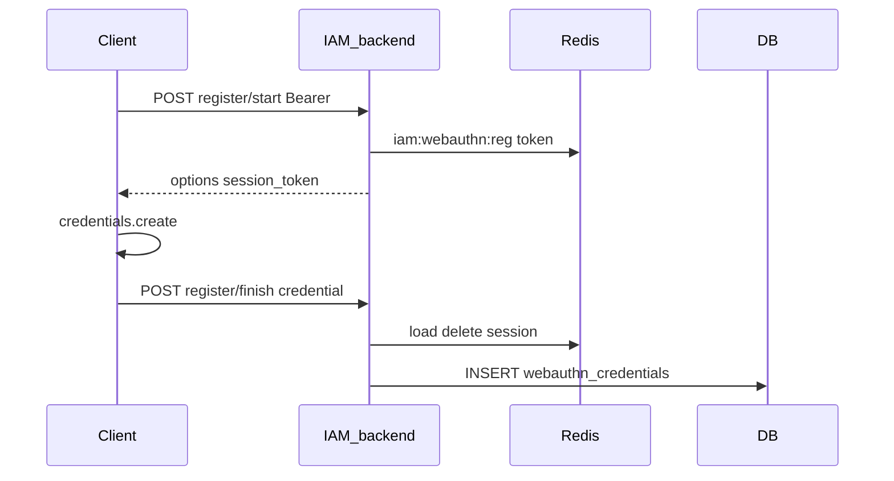
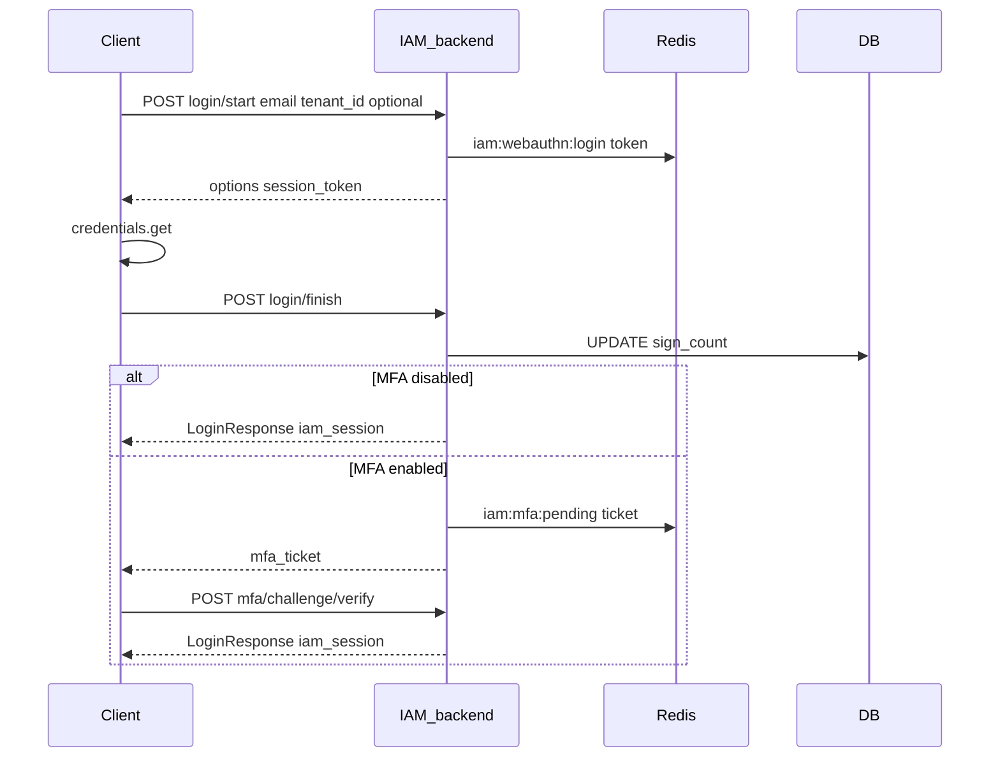

# Passkeys (WebAuthn) and MFA (TOTP)

## Summary

Users can register **passkeys** (WebAuthn) and enroll **TOTP MFA** with **recovery codes**. Passkey ceremonies use a two-step `start` → `finish` pattern with ephemeral Redis session tokens. MFA enrollment requires a Bearer JWT; post-login MFA step-up uses an `mfa_ticket` from password or passkey login before tokens and `iam_session` are issued.

## Endpoints

| Method | Path | Auth |
|--------|------|------|
| POST | `/api/v1/webauthn/register/start` | Bearer JWT |
| POST | `/api/v1/webauthn/register/finish` | Bearer JWT |
| GET | `/api/v1/webauthn/credentials` | Bearer JWT |
| POST | `/api/v1/webauthn/login/start` | Public |
| POST | `/api/v1/webauthn/login/finish` | Public |
| POST | `/api/v1/mfa/totp/setup` | Bearer JWT |
| POST | `/api/v1/mfa/totp/verify` | Bearer JWT (enables TOTP) |
| POST | `/api/v1/mfa/recovery-codes` | Bearer JWT |
| POST | `/api/v1/mfa/challenge/verify` | Public (`mfa_ticket`) |

## Request flow

### Passkey registration (authenticated)

### Passkey login with optional MFA

### Password login with MFA

Same MFA branch as passkey: `POST /api/v1/login` → `mfa_ticket` → `POST /api/v1/mfa/challenge/verify`.

## Persistence

### PostgreSQL

| Table | Operations |
|-------|------------|
| `webauthn_credentials` | Insert on register; read/update `sign_count` on login (**user-scoped**, no `tenant_id` column) |
| `user_mfa_totps` | Insert on setup; set `enabled` on verify (**user-scoped**) |
| `user_mfa_recovery_codes` | Insert hashes on generate; mark `used_at` on consume |
| `sessions` | Insert after successful login (with or without MFA verify) |

Login APIs may accept optional `tenant_id` to set the **active tenant** in JWT; credentials themselves are per-user globally.

### Redis

| Key | TTL | Purpose |
|-----|-----|---------|
| `iam:webauthn:reg:{token}` | `WEBAUTHN_SESSION_TTL` | Registration ceremony state |
| `iam:webauthn:login:{token}` | `WEBAUTHN_SESSION_TTL` | Login ceremony state |
| `iam:mfa:pending:{ticket}` | `MFA_PENDING_TICKET_TTL` | Pending login after primary auth |

MFA `code` rules: 6 digits → TOTP; otherwise recovery code.

## Code map

| Layer | File |
|-------|------|
| WebAuthn handler | `internal/handlers/webauthn.go` |
| MFA handler | `internal/handlers/mfa.go` |
| Auth handler | `internal/handlers/auth.go` (password + MFA ticket) |
| WebAuthn service | `internal/services/webauthn.go` |
| MFA service | `internal/services/mfa.go` |
| Ephemeral store | `internal/auth/ephemeral_redis.go` |
| WebAuthn domain | `internal/domains/webauthn/` |
| Crypto | `internal/crypto/` (TOTP secret encryption) |

## Configuration

| Variable | Purpose |
|----------|---------|
| `WEBAUTHN_RP_ID` | RP ID (host only, e.g. `localhost`) |
| `WEBAUTHN_RP_DISPLAY_NAME` | Display name |
| `WEBAUTHN_RP_ORIGINS` | Allowed origins (comma-separated) |
| `WEBAUTHN_SESSION_TTL` | Ceremony session TTL |
| `MFA_ENCRYPTION_KEY` | TOTP secret encryption (falls back to `JWT_SECRET`) |
| `MFA_PENDING_TICKET_TTL` | MFA ticket TTL |
| `MFA_RECOVERY_CODE_COUNT` | Codes generated per request |

## Frontend touchpoints

- `frontend/src/features/webauthn/passkey-login.tsx`, `passkey-register.tsx`
- `frontend/src/features/mfa/mfa-challenge-form.tsx`, `totp-setup.tsx`
- `frontend/src/pages/security-page.tsx`

## Testing

- [testing/PASSKEY_MFA_CURL.md](../testing/PASSKEY_MFA_CURL.md)
- WebAuthn finish steps require a browser (platform authenticator)

## Related features

- [SSO_SESSION.md](SSO_SESSION.md) — `iam_session` after login
- [MULTI_TENANT.md](MULTI_TENANT.md) — optional `tenant_id` on login
- [OIDC.md](OIDC.md) — continue OIDC after API login
