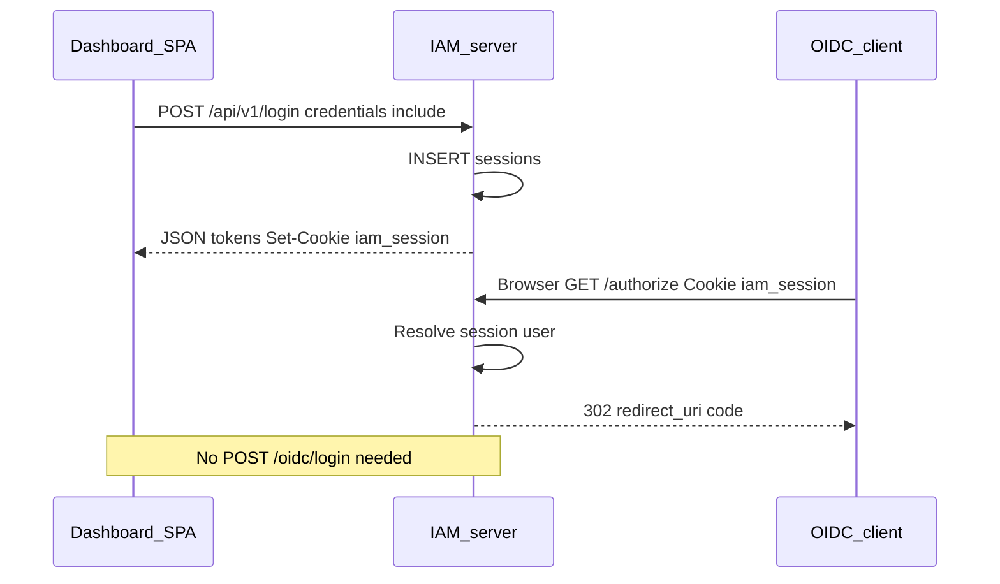

# SSO browser session

## Summary

A single browser **SSO session** (`iam_session` cookie) is shared between dashboard login (`POST /api/v1/login`), OIDC browser login (`POST /oidc/login`), passkey/MFA login, and federation callback. After one successful login on the IAM origin, `GET /authorize` proceeds without re-entering credentials. Logout invalidates all server-side sessions and refresh tokens for the user.

## Endpoints

| Method | Path | Auth | Sets / uses session |
|--------|------|------|---------------------|
| POST | `/api/v1/login` | Public | Sets `iam_session` |
| POST | `/oidc/login` | Public (CSRF) | Sets `iam_session`, redirects |
| POST | `/api/v1/webauthn/login/finish` | Public | Sets `iam_session` on success |
| POST | `/api/v1/mfa/challenge/verify` | Public | Sets `iam_session` after MFA |
| GET | `/oidc/federation/:provider/callback` | Public | Sets `iam_session` |
| GET | `/authorize` | Cookie | Reads `iam_session` |
| POST | `/api/v1/logout` | Bearer JWT | Clears all sessions + cookie |

## Request flow

## Cookie: `iam_session`

| Attribute | Value |
|-----------|--------|
| Name | `iam_session` |
| Value | Opaque UUID → `sessions.id` |
| Path | `/` |
| HttpOnly | `true` |
| SameSite | `Lax` |
| Secure | `true` when `APP_ENV=production` |

SPAs must use the IAM **origin** and `credentials: 'include'` so the cookie is stored and sent to `/authorize`.

## Session lifetime

TTL is set at session creation (successful login):

| `remember_me` | Config | Effective TTL |
|---------------|--------|----------------|
| false / omitted | `SSO_SESSION_TTL` > 0 | `SSO_SESSION_TTL` |
| false / omitted | `SSO_SESSION_TTL` = 0 | `JWT_REFRESH_TTL` |
| true | `SSO_SESSION_REMEMBER_TTL` > 0 | `SSO_SESSION_REMEMBER_TTL` |
| true | `SSO_SESSION_REMEMBER_TTL` = 0 | Fallback 720h in code |

## Logout effects

`POST /api/v1/logout` (Bearer access token):

1. Soft-deletes **all** `sessions` rows for the user.
2. Revokes **all** non-expired `refresh_tokens` for the user.
3. Clears `iam_session` cookie (`Max-Age=-1`).

## Persistence

### PostgreSQL

| Table | Operations |
|-------|------------|
| `sessions` | Insert on login; read on `/authorize`; soft-delete on logout |
| `refresh_tokens` | Revoke all for user on logout |

### Redis

None.

## Code map

| Layer | File |
|-------|------|
| Session service | `internal/services/session.go` |
| Auth handler | `internal/handlers/auth.go` (login, logout) |
| OIDC handler | `internal/handlers/oidc.go` (authorize, oidc login) |
| WebAuthn / MFA handlers | Set session via shared login completion |

## Configuration

| Variable | Purpose |
|----------|---------|
| `SSO_SESSION_TTL` | Non–remember-me session length (0 → use `JWT_REFRESH_TTL`) |
| `SSO_SESSION_REMEMBER_TTL` | Remember-me session length |
| `JWT_REFRESH_TTL` | Default SSO TTL when `SSO_SESSION_TTL` unset |
| `APP_BASE_URL` | Same-origin assumption for cookie model |

**Cross-origin note:** Cookie is not sent cross-origin unless shared parent domain + explicit `Domain` attribute (not configured by default).

## Frontend touchpoints

- `apiFetch()` uses `credentials: 'include'` (`frontend/src/api/client.ts`).
- Token refresh and logout in `frontend/src/auth/auth-provider.tsx`.

## Testing

- [testing/SSO_CURL.md](../testing/SSO_CURL.md)
- [testing/OIDC_CURL.md](../testing/OIDC_CURL.md) (Postman variant)

## Related features

- [OIDC.md](OIDC.md) — authorize after session exists
- [PASSKEY_MFA.md](PASSKEY_MFA.md) — login paths that set session
- [FEDERATION.md](FEDERATION.md) — federation sets session before authorize
